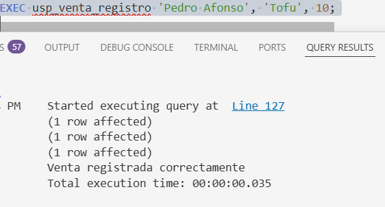
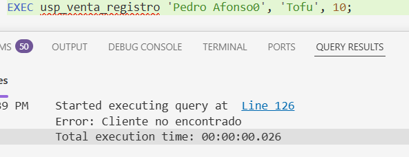
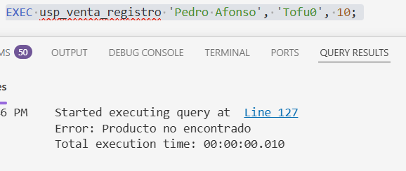
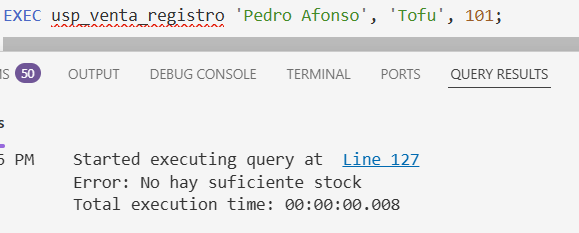

# STORED PROCEDURES 

**PRACTICA NÚMERO 1 - INSERTAR SOLO UN PRODUCTO**


> Creación de la base de datos y tablas 

**Creación de la base de datos**
- En este primer bloque de código se creo la base de datos y fue utilizada para las siguientes instrucciones

 ```sql

CREATE DATABASE STORED1;
GO
USE STORED1;

 ```
**Creación de tablas**
- Tabla productos

```sql
--Se vaciaron los datos de tabla Products de NORTHWND
SELECT ProductID AS idProducto, ProductName AS nombre, UnitPrice AS precio, UnitsInStock AS existencia
INTO producto
FROM NORTHWND.[dbo].[Products];

GO
--Aquí solamente se declaro la PRIMARY KEY
ALTER TABLE producto
ADD PRIMARY KEY (idProducto);

GO

```
- Tabla cliente

```sql
--Se vaciaron los datos de tabla Customers de NORTHWND
SELECT CustomerID AS idCliente, ContactName AS nombre, Country AS pais, city AS ciudad
INTO cliente
FROM NORTHWND.[dbo].[Customers]
GO

--Aquí solamente se declaro la PRIMARY KEY
ALTER TABLE cliente
ADD PRIMARY KEY (idCliente);

GO

```
- Tabla venta

```sql
--La tabla se creo manualmente con sus respectivos campos
CREATE TABLE venta (

    idVenta int PRIMARY KEY IDENTITY(1,1) NOT NULL,
    fecha DATE NOT NULL,
    cliente NCHAR(5) NOT NULL,
    CONSTRAINT fk_venta_cliente
    FOREIGN KEY (cliente)
    REFERENCES cliente (idCliente)
);

```

- Tabla detalleVenta

```sql
--La tabla se creo manualmente con sus respectivos campos

CREATE table detalleVenta(

    idVenta int NOT NULL,
    idProducto int NOT NULL,
    precioVenta money NOT NULL,
    cantidad int NOT NULL,

    CONSTRAINT PK_DetalleVenta
    PRIMARY KEY (idVenta, idProducto),

    CONSTRAINT fk_dv_venta
    FOREIGN KEY (idVenta)
    REFERENCES venta (idVenta),

    CONSTRAINT fk_dv_producto
    FOREIGN KEY(idProducto)
    REFERENCES producto (idProducto)

);

```

> Stored Procedures y Triggers

**Store Procedure**


```sql

GO

CREATE OR ALTER PROC usp_venta_registro
--Estos son los parámetros que el usuario debe ingresar (nombre del cliente, nombre del producto y la cantidad de ellos)

    @nombreCliente NVARCHAR(30),
    @nombreProducto NVARCHAR(40),
    @cantidadProductos INT
AS
BEGIN

    BEGIN TRY
    --Empezamos el manejo de rrores con un TRY

-- Aquí declaramos la variable @idCliente y con una subconsukta lo extraemos
    DECLARE @idCliente NVARCHAR(5)
    SET @idCliente = (SELECT idCliente FROM cliente WHERE nombre = @nombreCliente) 

--Aquí comienzan las validaciones
    -- Validación para saber si el cliente existe

    IF NOT EXISTS(SELECT 1 FROM cliente WHERE idCliente = @idCliente)
       BEGIN
        THROW 50001, 'Cliente no encontrado', 1;
        
       END 
 
    -- Validación para saber si el producto existe   
    IF NOT EXISTS(SELECT 1 FROM producto WHERE nombre = @nombreProducto)
       BEGIN 
        THROW 50001,'Producto no encontrado',1;
       END 
       

    -- Validación para saber si hay suficiente stock
    IF (@cantidadProductos > (SELECT existencia FROM producto WHERE nombre = @nombreProducto))
       BEGIN 
        THROW 50001,'No hay suficiente stock',1;
       END 

    -- Empieza la transacción
    BEGIN TRANSACTION;

    -- Extraemos la fecha con la función GETDATE
    DECLARE @fecha DATE
        SET @fecha = GETDATE()

    -- Se inserta en la tabla venta el nuevo registro de venta con sus respectivos campos

        INSERT INTO venta
        VALUES (@fecha, @idCliente)

    --Extraemos el precio con una subconsulta
    DECLARE @precio money
    SET @precio = (SELECT precio FROM producto WHERE nombre = @nombreProducto)

 --Extraemos el idVenta con la función SCOPE_IDENTITY y el idProducto con una subconsulta

    DECLARE @idVenta int
    SET @idVenta = SCOPE_IDENTITY()

    DECLARE @idProducto int
    SET @idProducto = (SELECT idProducto FROM producto WHERE nombre = @nombreProducto)

    -- Se inserta en la tabla detalleVenta el nuevo registro de este con sus respectivos campos

    INSERT INTO detalleVenta (idVenta, idProducto, precioVenta, cantidad)
    VALUES (@idVenta, @idProducto, @precio, @cantidadProductos)

    --Se hace una actualización en la tabla producto en el campo existencia, restandole la cantidad de productos que se envio en el parámetro

    UPDATE producto
    SET existencia = existencia-@cantidadProductos
    WHERE idProducto = @idProducto;

    COMMIT -- Se guardan los cambios
    PRINT('Venta registrada correctamente');
    END TRY

    -- Empieza el catch donde recibira los errores en caso de que ocurran 
    BEGIN CATCH
    -- Vertifica si hay una transacción abierta
    IF @@TRANCOUNT > 0
    --Vuelve a su estado anterior en caso de un error
        ROLLBACK;
        --Manda el error que ocurrio
        PRINT 'Error: ' + ERROR_MESSAGE();
    END CATCH

END; 
GO
```
> Funcionamiento del SP

**Funcionamiento**



**Validación de Cliente**



**Validación de Productos**



**Validación de Stock**



**Trigger**

```sql

-- Trigger que valida que el precio de venta no se pueda actualizar

GO
CREATE OR ALTER TRIGGER trg_validar_cambio
ON [dbo].[detalleVenta]
AFTER UPDATE 
AS
BEGIN
    IF EXISTS (SELECT 1 
    FROM inserted AS i
    INNER JOIN deleted AS d
    ON i.idVenta = d.idVenta
    WHERE i.precioVenta <> d.precioVenta)
    BEGIN
        PRINT 'El precio de venta no se puede actualizar'
        ROLLBACK TRANSACTION;
    END;

END;
GO

-- Trigger que valida que la cantidad no se pueda actualizar

CREATE OR ALTER TRIGGER trg_validar_cambio
ON [dbo].[detalleVenta]
AFTER UPDATE 
AS
BEGIN
    IF EXISTS (SELECT 1 
    FROM inserted AS i
    INNER JOIN deleted AS d
    ON i.idVenta = d.idVenta
    WHERE i.cantidad<> d.precioVenta)
    BEGIN
        PRINT 'La cantidad no se puede actualizar'
        ROLLBACK TRANSACTION;
    END;

END;

```