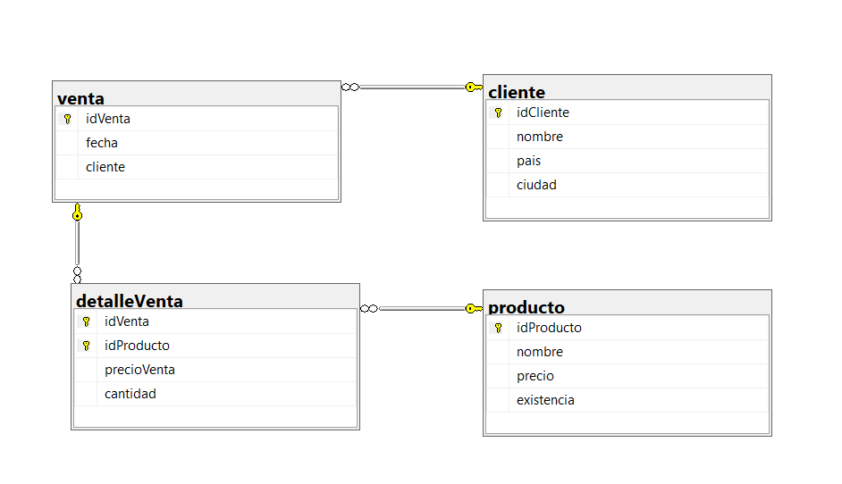
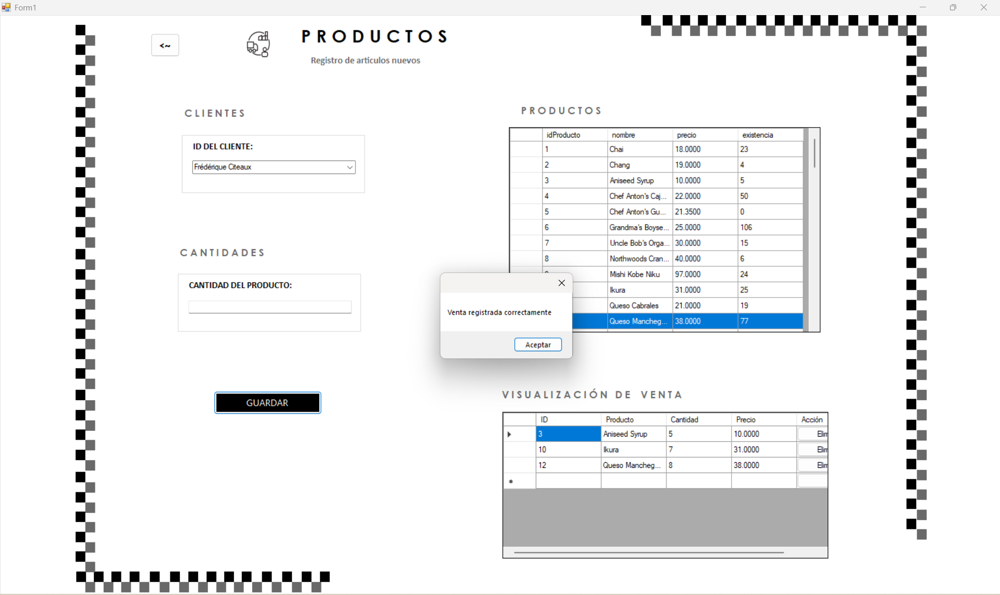

# STORED PROCEDURES 

**PRACTICA NÚMERO 2 - INSERTAR VARIOS PRODUCTOS CON UNA TABLA TYPE**

> Visualización de la base de datos

**Diagrama**



> Creación de la base de datos y tablas 

**Creación de la tabla Type**
- En este primer bloque de código se creo la tabla type que permitira que ser enviado como parametro al SP que enviara varios productos.

 ```sql

CREATE TYPE productosType AS TABLE(

    idCliente NVARCHAR(5),
    cantidad int NOT NULL,
    idProductos INT NOT NULL

);

 ```

 > Stored Procedures 

**Store Procedure para consultar todos los clientes**

- Primero se creo un SP que permita traer todos los registros de los clientes para que este se pueda ver reflejado en el ComboBox en la interfaz.

 ```sql

CREATE OR ALTER PROC usp_consultar_clientes
AS 
BEGIN
    SELECT *
    FROM cliente;
END;

 ```
**Store Procedure para consultar todos los productos**

- Después se creo un SP que permita traer todos los registros de los productos para que este se pueda ver reflejado en el DataGridView en la interfaz.


 ```sql

CREATE OR ALTER PROC usp_consultar_productos
AS 
BEGIN
    SELECT *
    FROM producto;
END;

 ```

 **Store Procedure para registrar varios productos**

- Por ultimo se creo el SP para registar varios productos que tuvo como parametro la tabla Type que se creo anteriormente.

 ```sql

CREATE OR ALTER PROC usp_venta_registro_multiple
    @productos productosType READONLY
AS
BEGIN
    BEGIN TRY

        IF EXISTS(SELECT 1 FROM @productos AS p 
        WHERE NOT EXISTS(SELECT 1 FROM cliente AS c WHERE c.idCliente = p.idCliente))
            
        BEGIN
            THROW 50001, 'Uno o más clientes no existen', 1;
        END
        
        IF EXISTS(SELECT 1 FROM @productos AS p 
        WHERE NOT EXISTS(SELECT 1 FROM producto AS pr WHERE pr.idProducto = p.idProductos))
        BEGIN
            THROW 50001, 'Uno o más productos no existen', 1;
        END
        
        IF EXISTS(SELECT 1 FROM @productos AS p
            INNER JOIN producto AS pr ON pr.idProducto = p.idProductos
            WHERE p.cantidad > pr.existencia
        )

        BEGIN
            THROW 50001, 'No hay suficiente stock para uno o más productos', 1;
        END
        
        BEGIN TRANSACTION;
        
        DECLARE @fecha DATE = GETDATE();
        DECLARE @idVenta INT;

        INSERT INTO venta (fecha, cliente)
        VALUES (@fecha, (SELECT TOP 1 idCliente FROM @productos));
        
        SET @idVenta = SCOPE_IDENTITY();

        INSERT INTO detalleVenta (idVenta, idProducto, precioVenta, cantidad)
        SELECT 
            @idVenta,
            p.idProductos,
            pr.precio,
            p.cantidad
        FROM @productos  AS p
        INNER JOIN producto pr ON pr.idProducto = p.idProductos;
        
        UPDATE pr
        SET existencia = pr.existencia - p.cantidad
        FROM producto pr
        INNER JOIN @productos p ON pr.idProducto = p.idProductos;
        
        COMMIT;
        
        PRINT('Venta registrada correctamente');
        
    END TRY
    
    BEGIN CATCH
        IF @@TRANCOUNT > 0
            ROLLBACK;
        
        PRINT('Error al registrar la venta');
        THROW;
    END CATCH
END;
GO

 ```

 >Aspectos que fueron nuevos en este SP 

 - Las validaciones para saber si el producto existia o si el stock era suficiente se cambiaron ya que ahora estabamos trabajando con varios al mismo timepo.

 ```sql
 IF EXISTS(SELECT 1 FROM @productos AS p 
        WHERE NOT EXISTS(SELECT 1 FROM producto AS pr WHERE pr.idProducto = p.idProductos))
        BEGIN
            THROW 50001, 'Uno o más productos no existen', 1;
        END
        
        IF EXISTS(SELECT 1 FROM @productos AS p
            INNER JOIN producto AS pr ON pr.idProducto = p.idProductos
            WHERE p.cantidad > pr.existencia
        )
 ```

 - El insertar una nueva venta con la fecha que se paso y usa el cliente que viene en el primer registro de la lista de productos
 ```sql
 
        INSERT INTO venta (fecha, cliente)
        VALUES (@fecha, (SELECT TOP 1 idCliente FROM @productos));
        
        SET @idVenta = SCOPE_IDENTITY();
 ```

 - Por cada producto que viene en la lista, inserta un registro en detalleVenta con: el ID de la venta, el ID del producto, su precio, y la cantidad comprada.

 ```sql
INSERT INTO detalleVenta (idVenta, idProducto, precioVenta, cantidad)
        SELECT 
            @idVenta,
            p.idProductos,
            pr.precio,
            p.cantidad
        FROM @productos  AS p
        INNER JOIN producto pr ON pr.idProducto = p.idProductos;
        
 ```
- A cada producto que se vendió, se resto del inventario la cantidad que el cliente compró

```sql
 INSERT INTO detalleVenta (idVenta, idProducto, precioVenta, cantidad)
        SELECT 
            @idVenta,
            p.idProductos,
            pr.precio,
            p.cantidad
        FROM @productos  AS p
        INNER JOIN producto pr ON pr.idProducto = p.idProductos;
        
 ```

> Vista del proyecto funcionando


